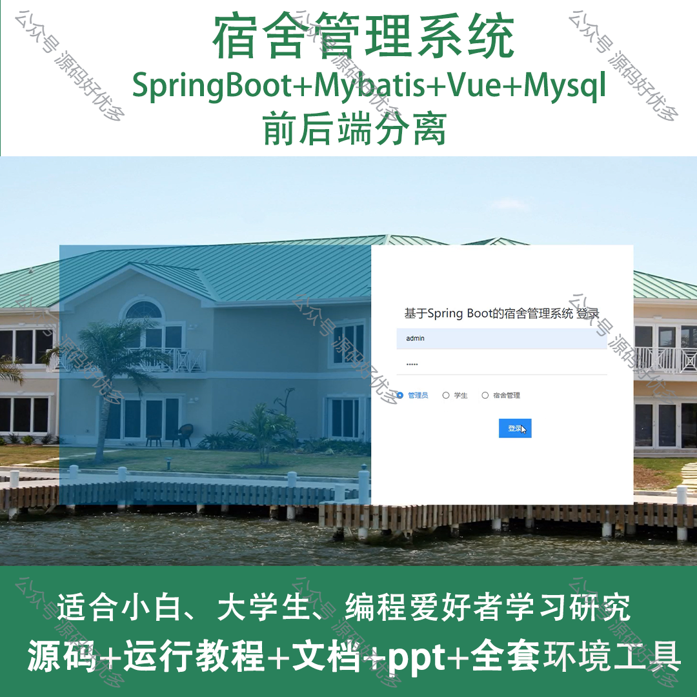
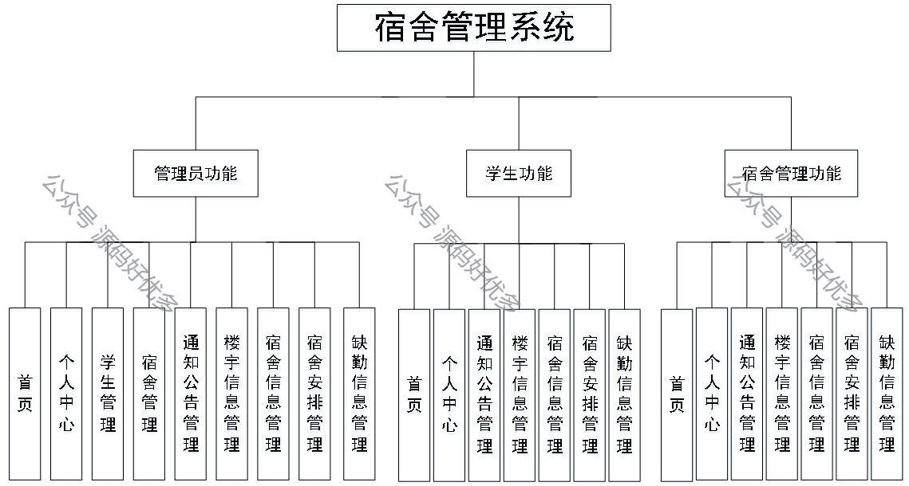
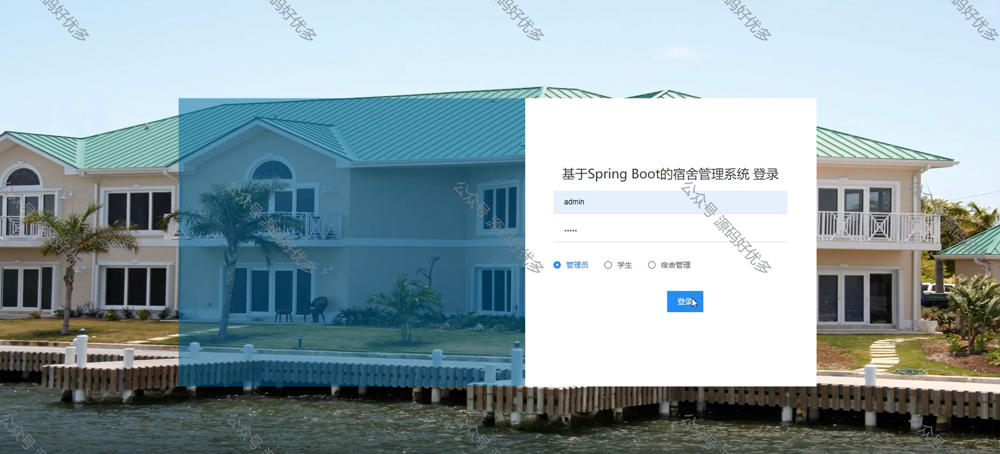
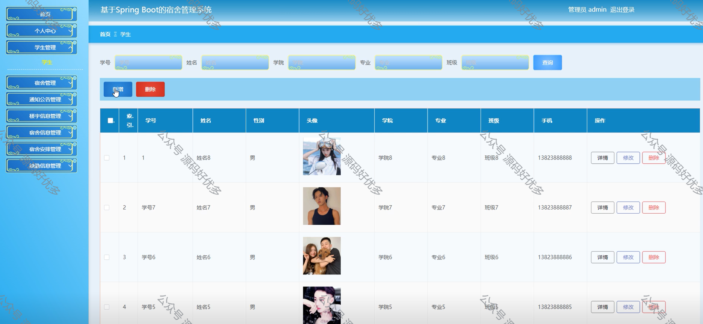
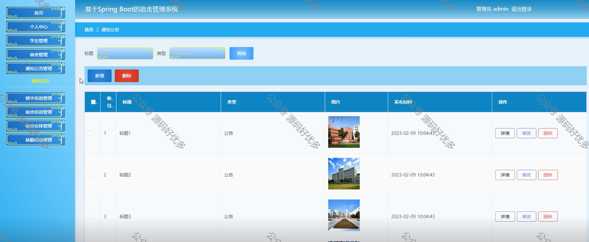
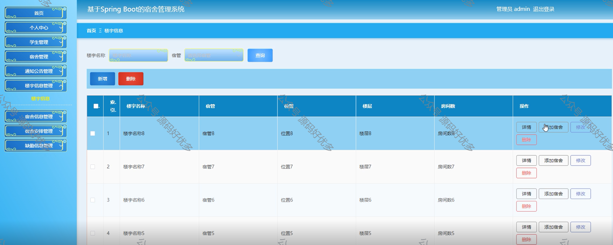
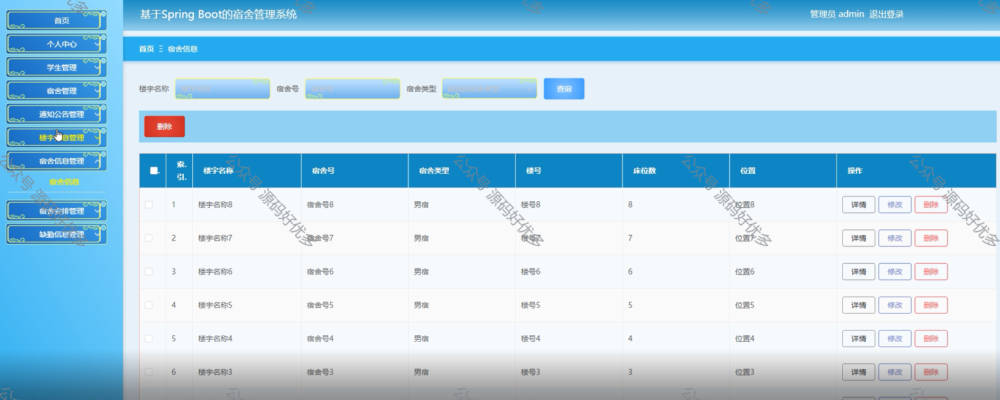
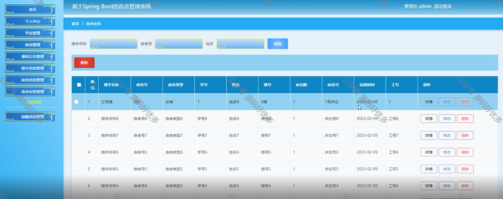
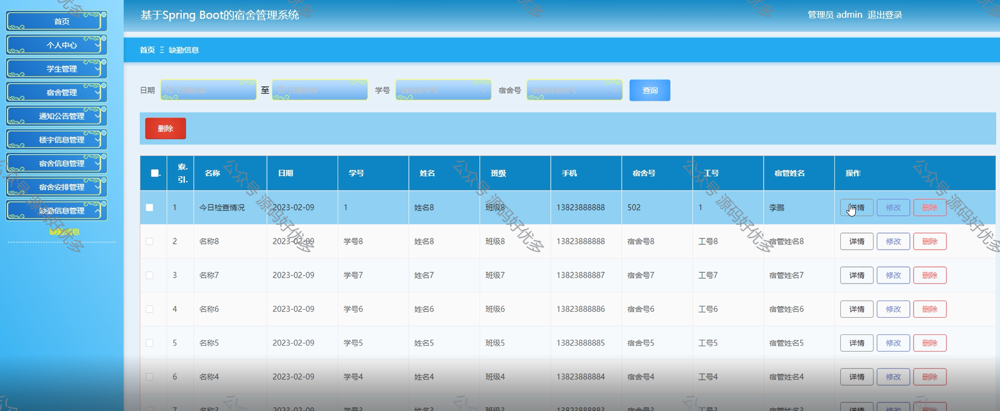
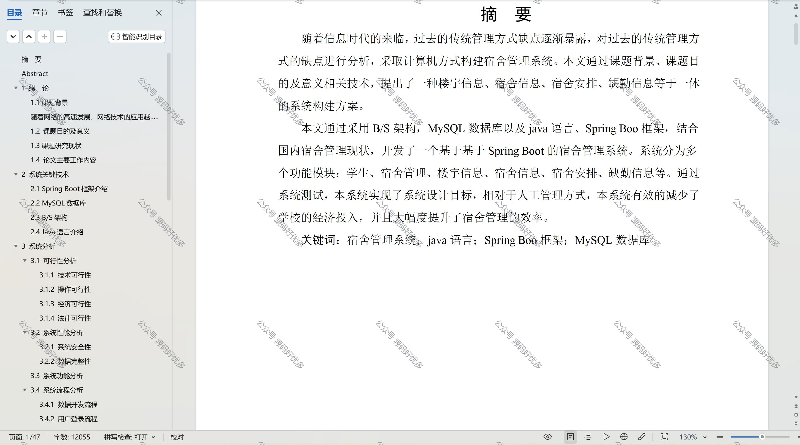

 
## 查看主页获取源码

> **作者介绍**： **✌**全网粉丝10W+本平台特邀作者、博客专家、CSDN新星计划导师、java领域优质创作者,博客之星、掘金/华为云/阿里云/InfoQ等平台优质作者、专注于项目实战 **✌**

  

### 一、作品包含

源码+数据库+设计文档万字+PPT+全套环境和工具资源+部署教程

### 二、项目技术

前端技术：Html、Css、Js、Vue、Element-ui

数据库：MySQL

后端技术：Java、Spring Boot、MyBatis

  

### 三、运行环境

开发工具：IDEA/eclipse

数据库：MySQL5.7

数据库管理工具：Navicat10以上版本

环境配置软件： JDK1.8+Maven3.6.3

前端Nodejs：14

### 四、项目介绍
项目编号：springbootA108

宿舍管理系统是在高校学生人数增长、宿舍资源需求日益紧张以及宿舍管理复杂度提升的背景下开发的，旨在通过信息化手段提高宿舍管理的效率和质量，确保学生住宿安全、舒适，以实现宿舍资源的合理分配和有效监管。

系统分为三个角色，管理员、学生、宿舍管理。

管理员的功能：首页、个人中心、学生管理、宿舍管理、通知公告管理、楼宇信息管理、宿舍信息管理、宿舍安排管理、缺勤信息管理。
学生的功能：首页、个人中心、通知公告管理、楼宇信息管理、宿舍信息管理、宿舍安排管理、缺勤信息管理。
宿舍管理的功能：首页、个人中心、通知公告管理、楼宇信息管理、宿舍信息管理、宿舍安排管理、缺勤信息管理。

### 五、运行截图

  

